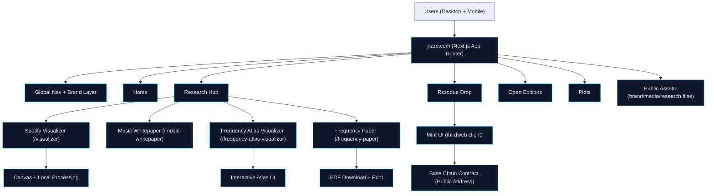

# Safe Public Architecture Layout for X (JRZZO Website)

## X Post Copy (Ready to Publish)
JRZZO website architecture (public-safe): research + visualizers + on-chain mint UX, all separated by route for clarity and scale.

Built to keep launch mechanics isolated while content and research evolve fast.

#JRZZO #Web3 #NextJS #DataViz #UX

## Public-Safe Architecture Layout (Use in image/slide)

## Pre-Post Safety Checklist
- Show only public routes/components.
- Show `Base Chain Contract (Public Address)` but do not include the literal address in the graphic.
- Do not show env var names/values, API keys, deployment IDs, internal repo paths, or vendor dashboard links.
- Keep wording at system level: `thirdweb client`, `public assets`, `App Router`.
- Avoid mentioning security headers/rate-limit specifics publicly.

## Validation Checklist
- Diagram is readable on mobile screenshot.
- No secrets/env values/commit hashes/private URLs are visible.
- Routes match production structure:
  - `/research`
  - `/visualizer`
  - `/music-whitepaper`
  - `/frequency-atlas-visualizer`
  - `/frequency-paper`
  - `/rzzodue`
- Branding uses `JRZZO` naming.

## Download Asset
- Download path: `/research/jrzzo-architecture-safe.png`
- Website URL: `https://jrzzo.com/research/jrzzo-architecture-safe.png`
